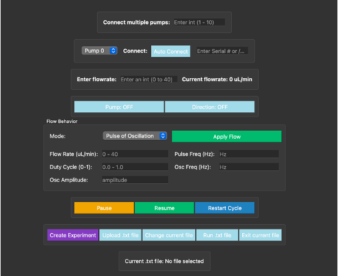
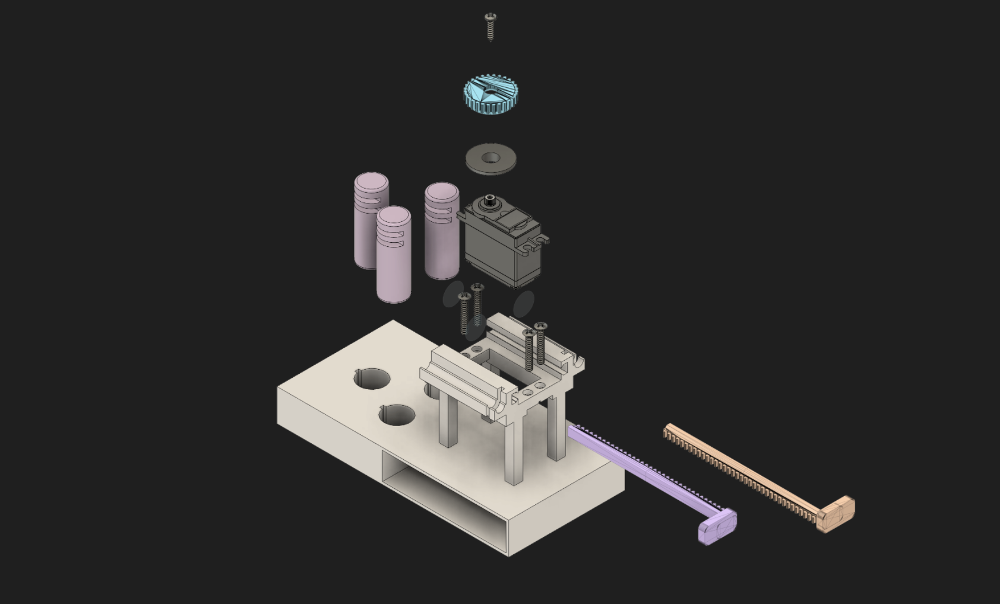

# An Open-Source Platform for Continuous Low-Flow Control

An open-source software and hardware platform for imposing flow rates and behaviors in a DIY pump mechanism. Includes a GUI front-end, Arduino firmware, and programmable flow behavior modes.

<p align="center">
  
</p>

[View on GitHub](https://github.com/SamOliveiraLab/DIY_DSCPM){: .btn }

---

## Quick Links

| Page | Description |
|------|-------------|
| [Setup & Installation](setup.html) | Requirements, dependencies, and how to run |
| [GUI User Guide](guide.html) | Full walkthrough of every feature |
| [Flow Behaviors](flow.html) | Constant, Pulse, Oscillation, and Pulse of Oscillation modes |
| [Experiment Builder](experiment.html) | Creating and running scheduled experiments |
| [Arduino Protocol](protocol.html) | Command format between Python and the microcontroller |
| [Troubleshooting](troubleshooting.html) | Common issues and fixes |

---

## Demo Videos

<!-- Replace VIDEO_ID_1 and VIDEO_ID_2 with your actual YouTube video IDs -->
<p align="center">
  <iframe width="560" height="315" src="https://www.youtube.com/embed/VIDEO_ID_1" frameborder="0" allowfullscreen></iframe>
</p>

<p align="center">
  <iframe width="560" height="315" src="https://www.youtube.com/embed/VIDEO_ID_2" frameborder="0" allowfullscreen></iframe>
</p>

---

## The Platform

<p align="center">
  
</p>

The platform consists of three core components:

- **GUI (Front-End)** - a desktop application to control flow rates, behaviors, and run scheduled experiments
- **DIY Pump Hardware** - a 3D-printed syringe pump driven by servo motors and solenoid valves
- **Flow Behaviors** - four programmable modes: Constant, Pulse, Oscillation, and Pulse of Oscillation

## Project Structure

```
DIY_DSCPM/
├── Arduino_code/
│   └── pump_JS_07222025.ino    # Arduino firmware
├── Python code/
│   ├── GUI.py                  # Entry point
│   ├── pump_app.py             # Main window and logic
│   ├── arduino_cmds.py         # Serial communication
│   ├── autoport.py             # USB auto-detection
│   └── pump_render.png         # Pump image
├── dist/
│   ├── PumpGUI.app             # Standalone macOS app
│   └── PumpGUI                 # Standalone CLI executable
└── README.md
```

---

*Developed at the [Oliveira Lab](https://github.com/SamOliveiraLab), North Carolina A&T State University.*
