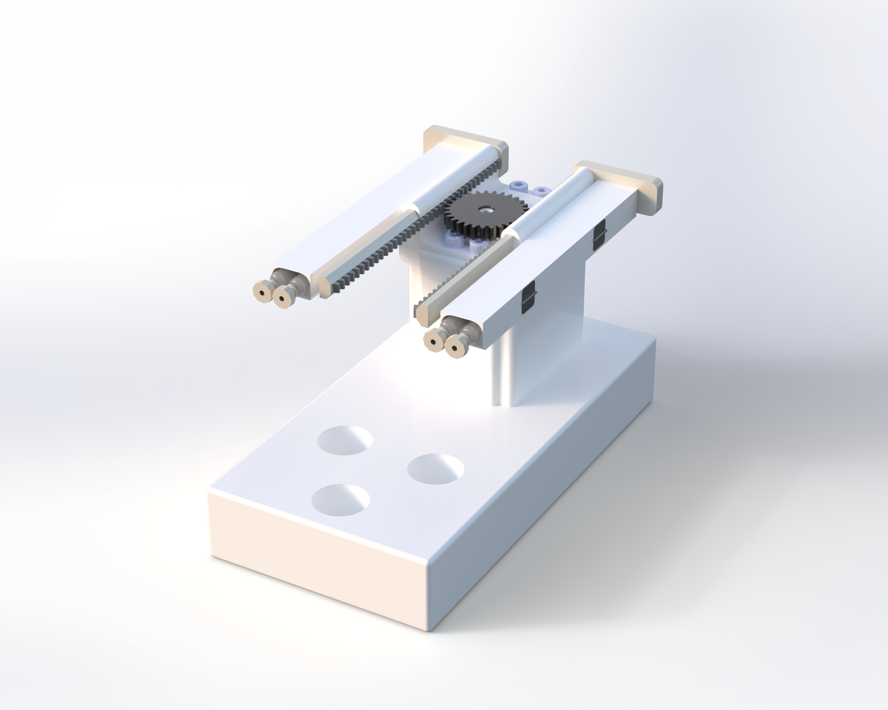

# DSCPM v2

**Dual Syringe Continuous Perfusion Module**

A PyQt5 desktop application for controlling dual syringe pumps via Arduino over USB serial. Supports multiple pump connections, four flow behavior modes, scheduled command sequences, and visual experiment building.

<p align="center">
  
</p>

[View on GitHub](https://github.com/SamOliveiraLab/DSCPM_v2){: .btn }

---

## Quick Links

| Page | Description |
|------|-------------|
| [Setup & Installation](setup.html) | Requirements, dependencies, and how to run |
| [GUI User Guide](guide.html) | Full walkthrough of every feature |
| [Flow Behaviors](flow.html) | Constant, Pulse, Oscillation, and Pulse of Oscillation modes |
| [Experiment Builder](experiment.html) | Creating and running scheduled experiments |
| [Arduino Protocol](protocol.html) | Command format between Python and the microcontroller |
| [Troubleshooting](troubleshooting.html) | Common issues and fixes |

---

## Overview

DSCPM v2 provides a graphical interface for researchers to control syringe pump hardware without writing code. Key capabilities include:

- **Multi-pump support** — connect and control up to 10 pumps simultaneously
- **Four flow modes** — Constant, Pulse, Oscillation, and Pulse of Oscillation
- **Experiment builder** — visually create timed command sequences and export them as files
- **Pause / Resume / Restart** — full control over running experiments
- **Live file preview** — see exactly what commands will execute before running

## Project Structure

```
DSCPM_v2/
├── Arduino_code/
│   └── pump_JS_07222025.ino    # Arduino firmware
├── Python code/
│   ├── GUI.py                  # Entry point
│   ├── pump_app.py             # Main window and logic
│   ├── arduino_cmds.py         # Serial communication
│   ├── autoport.py             # USB auto-detection
│   └── pump_render.png         # Pump image
├── dist/
│   ├── PumpGUI.app             # Standalone macOS app
│   └── PumpGUI                 # Standalone CLI executable
└── README.md
```

---

*Developed at the [Oliveira Lab](https://github.com/SamOliveiraLab), North Carolina A&T State University.*
